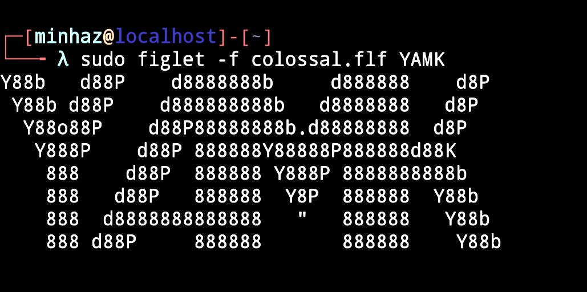

  

# YAMK (Custom Android Kernel)

  
  
   
  
  
  
  

 

**YAMK** is a custom Android Linux kernel meticulously engineered to deliver uncompromising performance, superior battery efficiency, and rock-solid daily stability. It is optimized from the ground up for power users who demand flawless multitasking and fluid UI responsiveness.

---

## 📑 Table of Contents
- [📊 Analytics](#-analytics)
- [🧪 Key Features](#-key-features)
- [📦 Build Variants](#-build-variants)
- [📱 Supported Devices](#-supported-devices)
- [🛑 Important Notes](#-important-notes)
- [🛠️ Flashing Instructions](#-flashing-instructions)
- [🐞 Bug Reports](#-bug-reports)

---

## 📊 Analytics

 

 
  
> 🧩 Grab the latest **Gamma(γ)** release directly from our [Releases Page](https://github.com/One4Lots/release/releases/tag/gamma).

> ⚠️ Version Naming Used From **GREEK** alphabet, It's not the traditional **Alpha** or **Beta** Stage Build.

 

---

## 🧪 Key Features & Optimizations

YAMK leverages cutting-edge compiler technologies to squeeze every ounce of performance out of your device's hardware:

* **Full LTO (Link-Time Optimization):** Analyzes and optimizes the entire kernel globally during the linking stage, resulting in a significantly smaller, faster, and more efficient binary footprint.
* **POLLY (Polyhedral Optimizations):** Utilizes advanced LLVM polyhedral models to drastically improve memory access patterns, cache locality, and loop execution.
* **MLGO (Machine Learning Guided Optimization):** Replaces traditional heuristics with machine learning models to make vastly superior inline and register allocation decisions during compilation.

---

## 📦 Build Variants

We offer two distinct builds tailored to your specific system environment. Please flash the correct version for your needs:

| Variant | Description & Use Case |
| :--- | :--- |
| **Standard Build** | The pure, stock kernel experience. Ideal for users who do not require root, or who prefer to manually flash traditional rooting solutions like `Magisk`. |
| **KernelSU-Next** | Includes natively integrated `KernelSU-Next` drivers. Features `MANUAL` hooks for a seamless, undetectable root experience directly from the kernel level. |

---

## 📱 Supported Devices

**Redmi Note 9 Pro India / Unified (`miatoll`)**
*Fully compatible with:* `curtana`, `joyeuse`, `excalibur`, `gram`

---

## 🛑 Important Notes

> **⚠️ Warranty & Liability Disclaimer:** By flashing this custom kernel, you acknowledge that you are fully responsible for any modifications made to your hardware. I am not liable for any system instability, bricked devices, hardware degradation, or data loss. 
> 
> **Always perform a full `boot` and `dtbo` backup via your custom recovery before proceeding.** Ensure you are flashing over a compatible, supported custom ROM.

---

## 🛠️ Flashing Instructions

1. **Backup:** Boot into your custom recovery (e.g., TWRP, OrangeFox) and create a full backup of your current `boot` and `dtbo` partitions.
2. **Flash:** Locate and install the downloaded YAMK `.zip` release file.
3. **Wipe:** (Optional but recommended) Wipe your Dalvik / ART Cache to ensure a clean boot.
4. **Reboot:** Reboot into the system and enjoy the upgraded experience!

---

## 🐞 Bug Reports

If you encounter kernel panics, random reboots, or other critical bugs, please open an issue in this repository. 

**Required for debugging:** You must attach your `dmesg` and `logcat` logs. Bug reports without proper logs will likely be closed, as we cannot diagnose issues blindly.

 

  <i>Compiled with ❤️ for the Android Development Community.</i>

